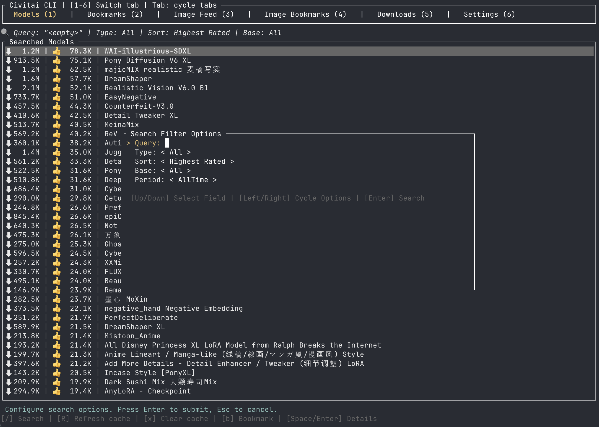
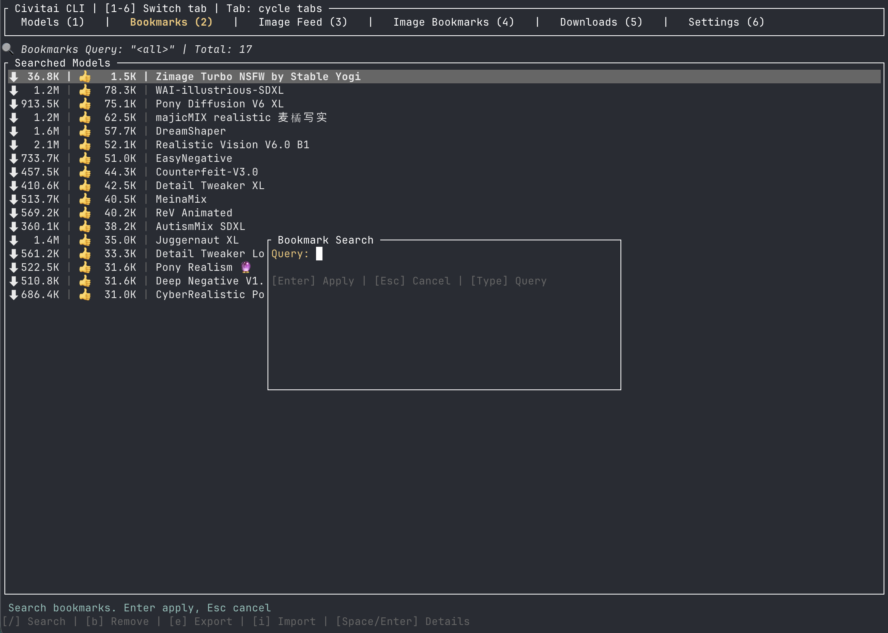
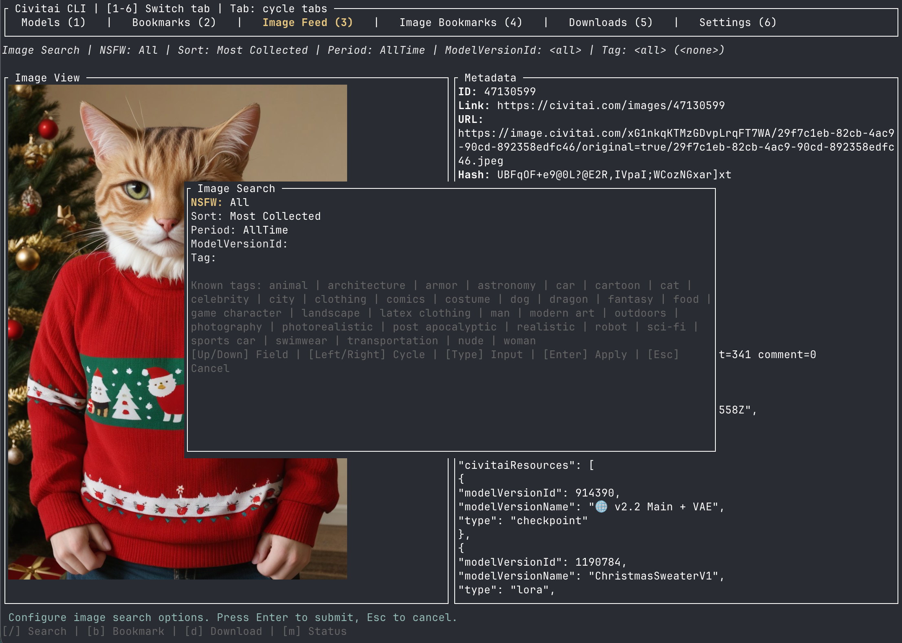
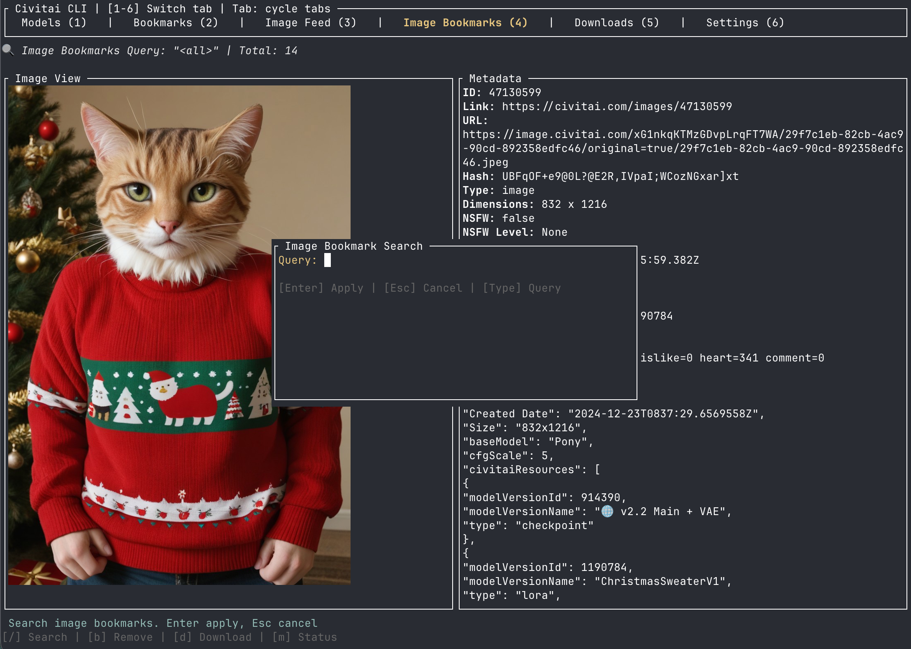
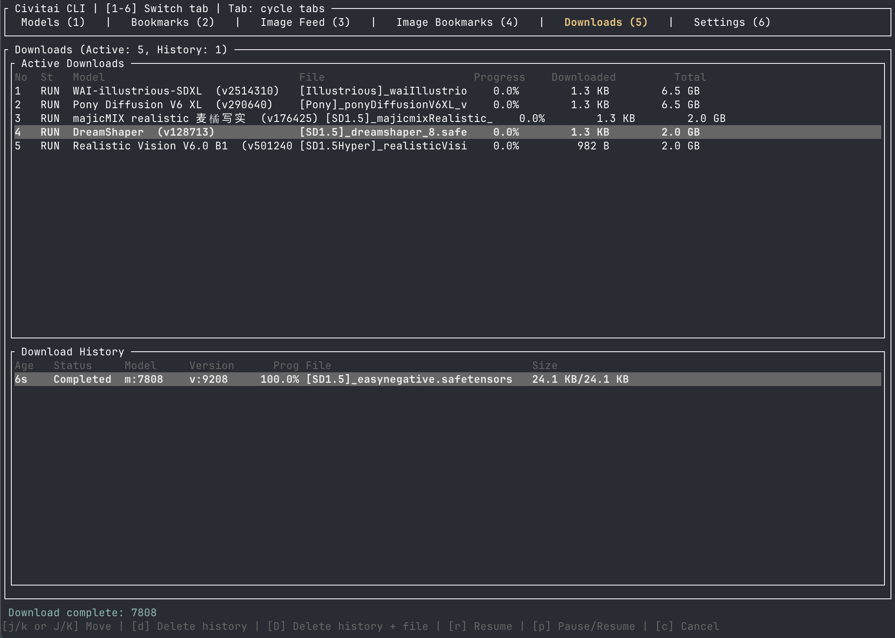
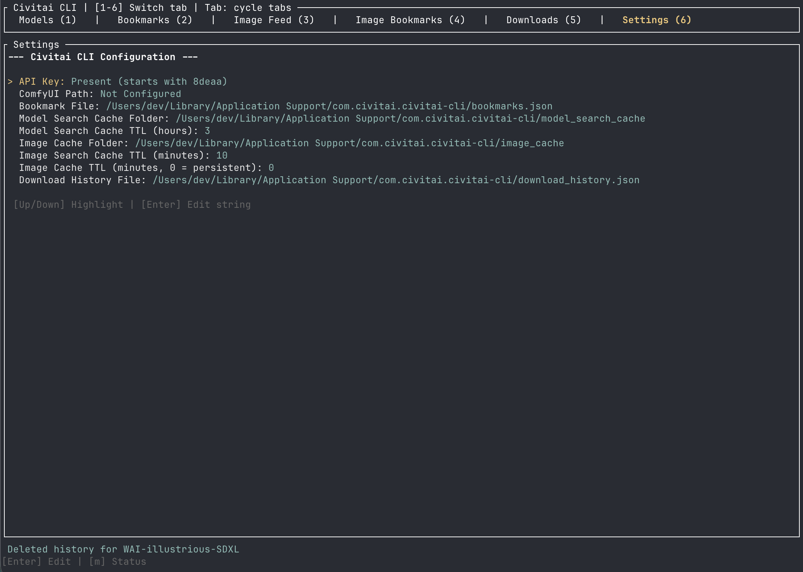

# civitai-cli

Terminal-first Civitai browser and downloader for ComfyUI-focused workflows.

`civitai-cli` provides:
- model browsing and search
- model bookmarks
- image feed browsing and search
- image bookmarks
- download management with pause, resume, cancel, and history
- persistent caches for model search, image search, model covers, and image bytes
- configurable local settings and cache locations

## Installation

Current project version: `1.1.0`

This is a TUI-heavy workflow tool built around the public Civitai API and local ComfyUI model folders.

### Requirements

- Rust stable
- `cargo`
- a terminal that supports the TUI stack used by `ratatui`

Optional but recommended:
- a configured ComfyUI directory
- a Civitai API key

### Clone

```bash
git clone https://github.com/Bogyie/civitai-cli.git
cd civitai-cli
```

### Build

```bash
cargo build
```

Or:

```bash
make build
```

### Install from release packages

Debian / Ubuntu:

```bash
curl -LO https://github.com/Bogyie/civitai-cli/releases/download/v1/civitai-cli_1.1.0_amd64.deb
sudo dpkg -i civitai-cli_1.1.0_amd64.deb
```

Fedora / RHEL / openSUSE:

```bash
curl -LO https://github.com/Bogyie/civitai-cli/releases/download/v1/civitai-cli-1.1.0-1.x86_64.rpm
sudo rpm -i civitai-cli-1.1.0-1.x86_64.rpm
```

## Screenshots

### Models



### Model Bookmarks



### Image Feed



### Image Bookmarks



### Downloads



### Settings



## Features

### Models

- Browse model lists from Civitai
- Query by:
  - text query
  - model type
  - sort
  - base model
  - period
- Infinite scrolling with `nextPage`-based loading
- Per-query result caching with TTL
- Highlight bookmarked models in the list
- View:
  - model description
  - stats
  - versions
  - files
  - cover image
  - metadata
- Prioritized model cover fetching for the currently selected model/version

### Model bookmarks

- Add or remove bookmarks directly from the model list
- Dedicated bookmark tab with model-like browsing
- Bookmark search/filter support
- Import and export bookmark lists
- Persistent bookmark storage

### Image feed

- Browse Civitai image feed in the TUI
- Search/filter by:
  - `nsfw`
  - `sort`
  - `period`
  - `modelVersionId`
  - `tags`
- Tag text is mapped to numeric tag IDs before querying
- Cursor-based pagination using `nextPage`
- Prefetch when you approach the end of the loaded image list
- Video items from the API are skipped automatically
- If a fetched page contains only skipped items, the app keeps loading until it finds image items or reaches the end
- Image panel supports:
  - rendered image preview
  - detailed image metadata
  - direct Civitai image link

### Image bookmarks

- Add or remove bookmarks directly from the image feed
- Dedicated image bookmark tab
- Search/filter inside bookmarked images
- Persistent image bookmark storage

### Downloads

- Download the selected model/version into ComfyUI-style folders
- Smart filenames based on base model and original filename
- Pause, resume, and cancel downloads
- Download history tab with status and progress
- Delete:
  - history only
  - history and downloaded file
- Interrupted download state is persisted
- On next app launch, interrupted downloads can be resumed

### Caching

- Model search cache:
  - persisted on disk
  - per-query cache entries
  - configurable TTL
- Image search cache:
  - persisted on disk
  - short TTL by default
  - configurable in settings
- Model cover cache:
  - stored separately on disk
- Image byte cache:
  - stored separately on disk
  - persistent by default unless TTL is configured

### Settings

Configurable from the TUI:
- API key
- ComfyUI path
- model bookmark path
- image bookmark path
- model search cache folder
- model cover cache folder
- image cache folder
- download history path
- interrupted download history path
- model search cache TTL
- image search cache TTL
- image byte cache TTL

## Authentication

The app supports authenticated Civitai requests using your API key.

For downloads, the app currently sends:
- `Authorization: Bearer <token>`
- `Content-Type: application/json`
- a `token=...` query parameter on the download URL

This is intentionally redundant because some download endpoints behave differently depending on how authentication is provided.

## Running

### Run the TUI

```bash
cargo run
```

Or:

```bash
make run
```

### Run in debug mode

```bash
make run-debug
```

Debug mode also enables fetch debug logging to the local config directory.

## CLI usage

### Open the TUI

```bash
cargo run -- ui
```

### Update config from CLI

```bash
cargo run -- config --api-key YOUR_TOKEN
```

```bash
cargo run -- config --comfyui-path /path/to/ComfyUI
```

### Download by model ID

```bash
cargo run -- download --id 123456
```

### Download by model version hash

```bash
cargo run -- download --hash abcdef123456
```

## TUI manual

### Tabs

The current tabs are:
- `1` Models
- `2` Bookmarks
- `3` Image Feed
- `4` Image Bookmarks
- `5` Downloads
- `6` Settings

Navigation:
- `Tab`: next tab
- number keys: jump to a tab directly

### Models tab

Primary actions:
- `j` / `k`: move through the model list
- `h` / `l`: move between versions of the selected model
- `/`: open model search form
- `R`: refresh the current model query and invalidate that cached result
- `b`: toggle bookmark for the selected model
- `d`: download the selected model/version
- `m`: open or close modal/details

What you can inspect:
- model description
- versions with index display
- file list
- stats
- model cover image
- metadata

### Bookmarks tab

Primary actions:
- `j` / `k`: move through bookmarks
- `/`: search bookmarks
- `b`: remove bookmark
- import/export are supported through modal-driven path input

### Image Feed tab

Primary actions:
- `j` / `k`: move through loaded images
- `/`: open image search form
- `b`: toggle image bookmark
- `m`: open or close modal/details

Image feed behavior:
- the feed starts loading when you enter the tab
- results are fetched in batches
- additional pages are loaded with `nextPage`
- prefetch starts when your current position reaches the last `5` loaded images
- video items are skipped

Displayed metadata includes:
- image id
- Civitai link
- original URL
- hash
- type
- dimensions
- NSFW flags
- browsing level
- created time
- post id
- username
- base model
- model version ids
- stats
- full `meta` JSON when present

### Image Bookmarks tab

- browse saved images
- search bookmarked images
- remove bookmarks with `b`

### Downloads tab

Primary actions:
- `p`: pause selected download
- `r`: resume selected download
- `c`: cancel selected download
- `d`: delete history entry only
- `D`: cancel if needed, then delete file and history entry

The downloads tab tracks:
- current downloaded size
- total size
- progress
- status
- persisted history across launches

### Settings tab

Use the settings UI to manage:
- API key
- local ComfyUI path
- cache locations
- bookmark/history paths
- TTL values for search and image caches

## Cache layout

Cache and persistence files are stored under the app config directory.

Typical contents include:
- model search cache directory
- image search cache directory
- model cover cache directory
- image cache directory
- bookmark files
- download history
- interrupted download state
- debug fetch log in debug builds

On macOS, the config base directory is typically:

```text
~/Library/Application Support/com.civitai/civitai-cli
```

On Linux, it is typically:

```text
~/.config/com.civitai/civitai-cli
```

## Make targets

Available targets from [Makefile](/Users/dev/repo/github/bogyie/civitai-cli/Makefile):

- `make build`
- `make run`
- `make run-debug`
- `make lint`
- `make fmt`
- `make fetch-log`
- `make tail-fetch-log`
- `make clear-fetch-log`

## Release flow

GitHub Actions is configured to create a GitHub Release automatically when a tag matching `v*` is pushed.

Example:

```bash
git tag v1.1.0
git push origin v1.1.0
```

The release workflow validates that the tag version matches the version in [Cargo.toml](/Users/dev/repo/github/bogyie/civitai-cli/Cargo.toml).

## Notes

- This project targets the public Civitai REST API and local ComfyUI usage.
- API response formats can be inconsistent, and the codebase contains compatibility handling for mixed field types.
- Image feed pagination and filtering rely on Civitai API behavior and may need future adjustment if upstream behavior changes.

## Korean documentation

Korean documentation is available at:

- [README-KO.md](/Users/dev/repo/github/bogyie/civitai-cli/README-KO.md)
