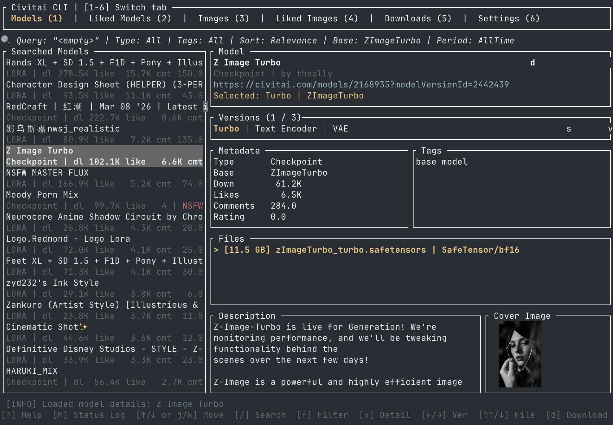
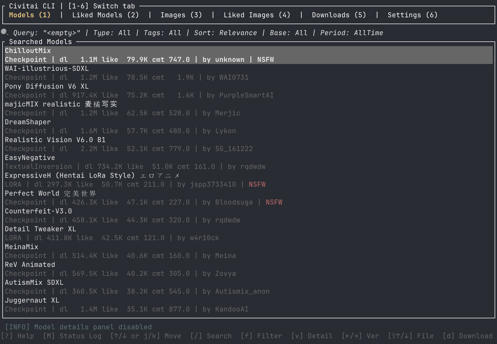
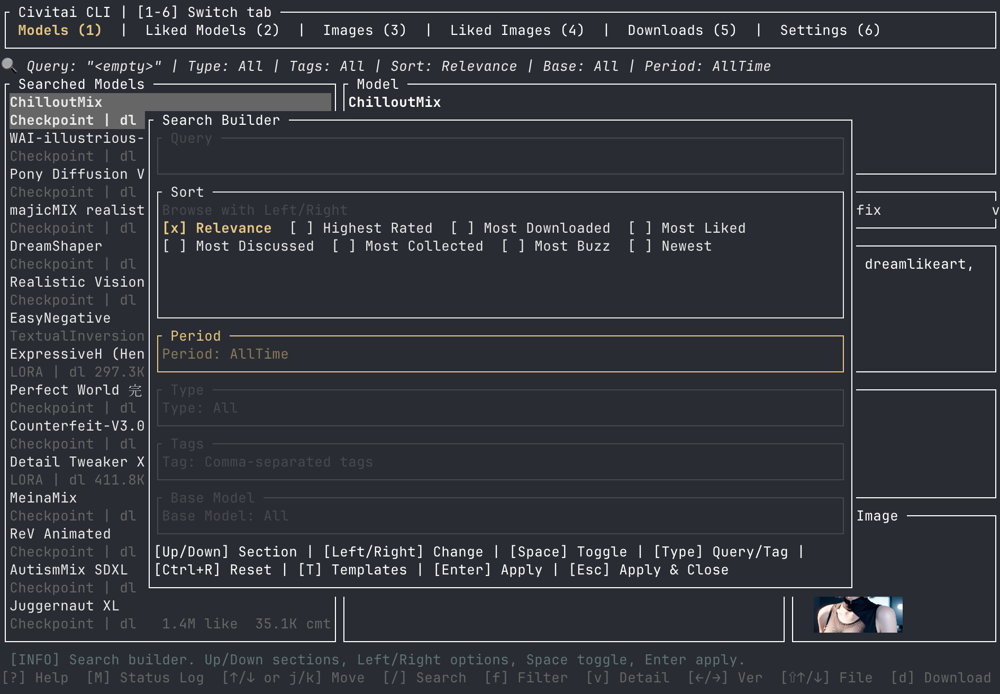
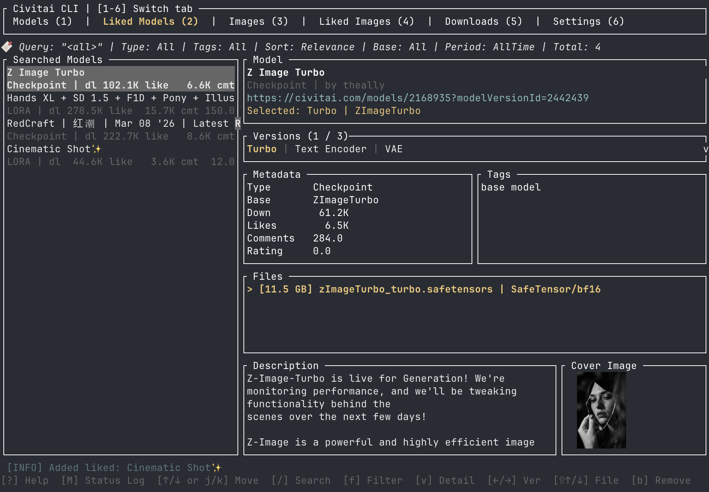
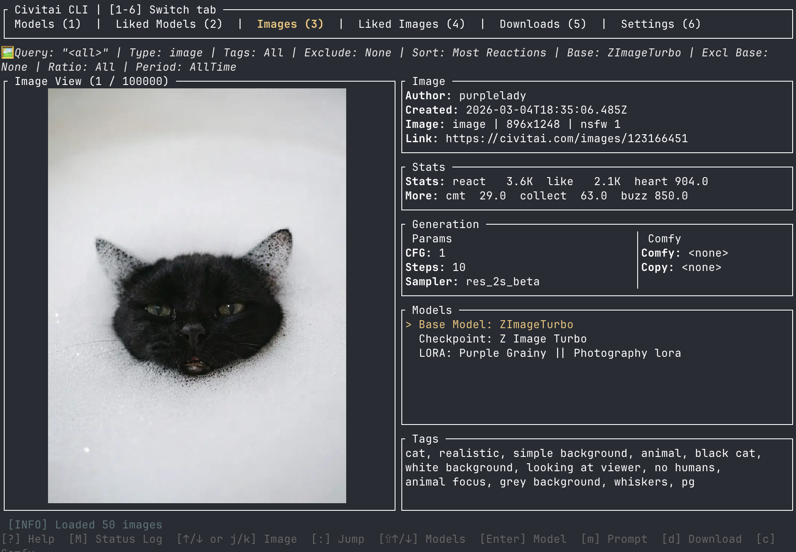
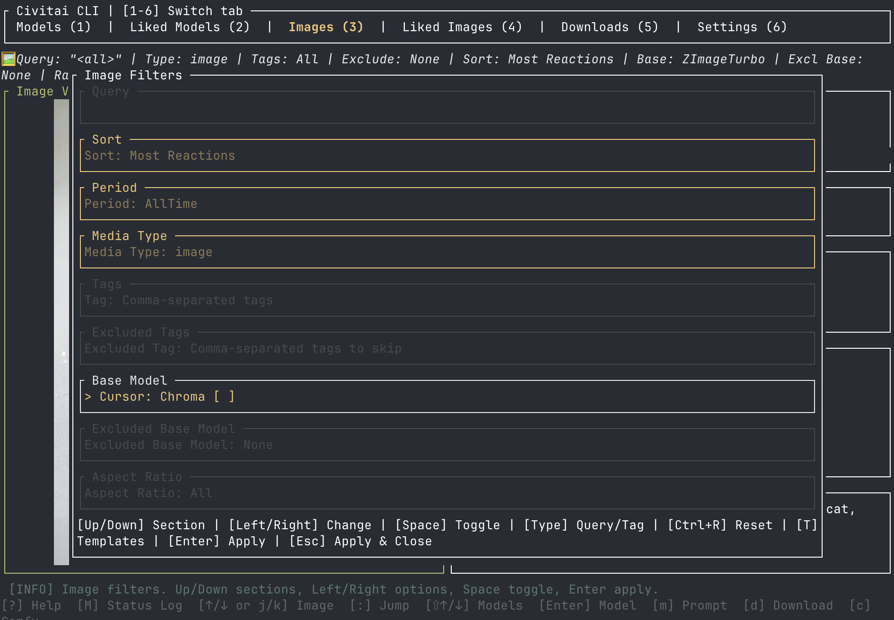
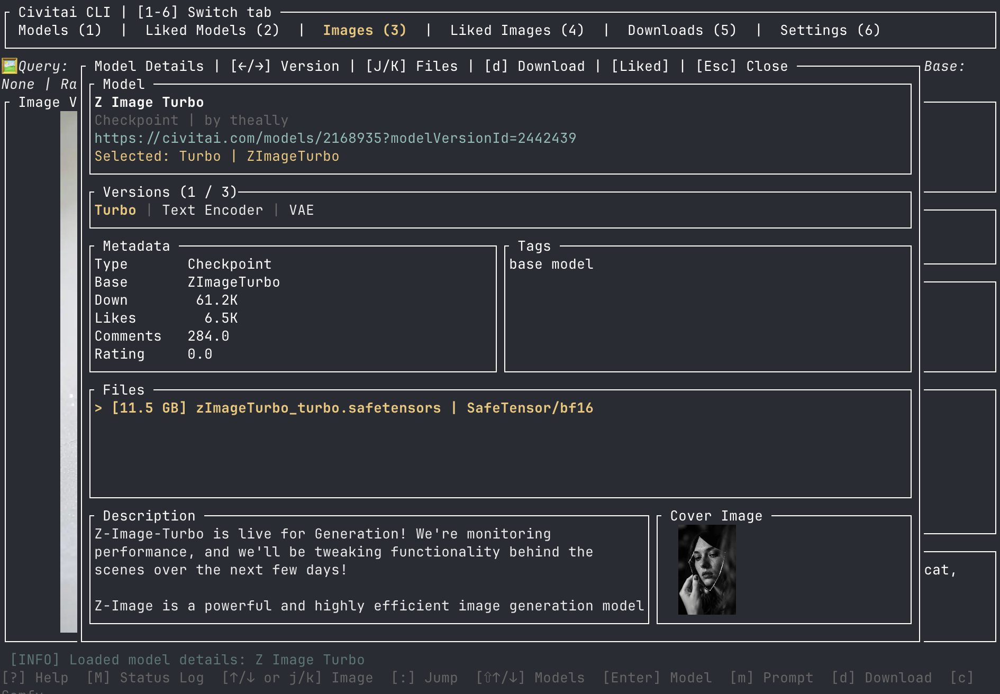
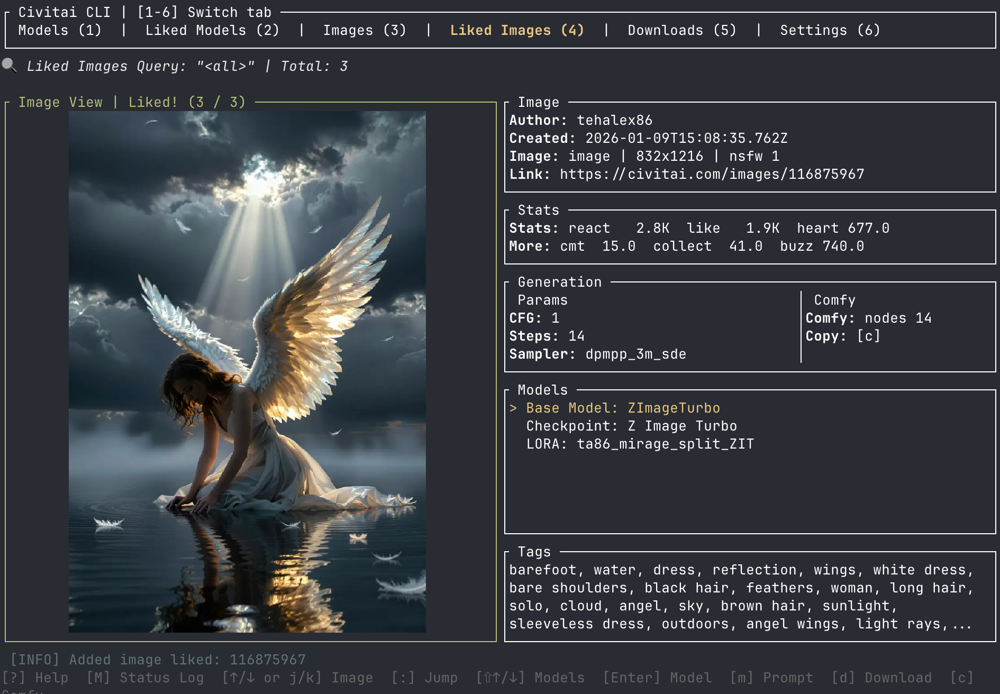

# civitai-cli

[](https://github.com/Bogyie/civitai-cli/releases)
[](https://github.com/Bogyie/civitai-cli/blob/main/LICENSE)
[](https://www.rust-lang.org/)

Terminal-first Civitai browser and downloader for ComfyUI-focused workflows.

If you spend more time in a terminal than in a browser, `civitai-cli` lets you browse models, inspect versions, explore images, save favorites, and download directly into your local ComfyUI setup without leaving the keyboard.

<p align="center">
  
</p>

## Why `civitai-cli`

- Fast keyboard-driven workflow for browsing Civitai
- Built for ComfyUI users who want local downloads and cache control
- Search models and images without bouncing between tabs in a browser
- Inspect model details, versions, files, metadata, and related images in one place
- Save liked models and images locally for later
- Resume interrupted downloads and keep persistent history

## Quick Start

Current project version: `1.4.4`

### Install from GitHub Releases

Debian / Ubuntu:

```bash
curl -LO https://github.com/Bogyie/civitai-cli/releases/download/v1.4.4/civitai-cli_1.4.4_amd64.deb
sudo dpkg -i civitai-cli_1.4.4_amd64.deb
```

Fedora / RHEL / openSUSE:

```bash
curl -LO https://github.com/Bogyie/civitai-cli/releases/download/v1.4.4/civitai-cli-1.4.4-1.x86_64.rpm
sudo rpm -i civitai-cli-1.4.4-1.x86_64.rpm
```

Static musl build for older Linux systems:

```bash
curl -LO https://github.com/Bogyie/civitai-cli/releases/download/v1.4.4/civitai-cli-v1.4.4-x86_64-unknown-linux-musl.tar.gz
tar -xzf civitai-cli-v1.4.4-x86_64-unknown-linux-musl.tar.gz
sudo install -m 755 civitai-cli-1.4.4-x86_64-unknown-linux-musl/civitai-cli /usr/local/bin/civitai-cli
```

### Build from source

Requirements:

- Rust stable
- `cargo`
- a terminal that supports the TUI stack used by `ratatui`

Optional but recommended:

- a configured ComfyUI directory
- a Civitai API key

```bash
git clone https://github.com/Bogyie/civitai-cli.git
cd civitai-cli
cargo build
```

Or:

```bash
make build
```

### First run

Open the TUI:

```bash
cargo run -- ui
```

Set your API key:

```bash
cargo run -- config --api-key YOUR_TOKEN
```

Set your ComfyUI path:

```bash
cargo run -- config --comfyui-path /path/to/ComfyUI
```

## Screenshots

<table>
  <tr>
    <td align="center"><strong>Model List</strong></td>
    <td align="center"><strong>Model Search</strong></td>
  </tr>
  <tr>
    <td></td>
    <td></td>
  </tr>
  <tr>
    <td align="center"><strong>Model Detail</strong></td>
    <td align="center"><strong>Liked Models</strong></td>
  </tr>
  <tr>
    <td></td>
    <td></td>
  </tr>
  <tr>
    <td align="center"><strong>Images</strong></td>
    <td align="center"><strong>Image Search</strong></td>
  </tr>
  <tr>
    <td></td>
    <td></td>
  </tr>
  <tr>
    <td align="center"><strong>Images by Model</strong></td>
    <td align="center"><strong>Liked Images</strong></td>
  </tr>
  <tr>
    <td></td>
    <td></td>
  </tr>
  <tr>
    <td align="center"><strong>Downloads</strong></td>
    <td align="center"><strong>Settings</strong></td>
  </tr>
  <tr>
    <td></td>
    <td></td>
  </tr>
</table>

## Feature Highlights

### Browse and search models

- Browse Civitai model lists in the terminal
- Search by text query, model type, sort, base model, and period
- Infinite scrolling with `nextPage`-based loading
- Per-query caching with configurable TTL

### Inspect model details without leaving the TUI

- View description, stats, versions, files, cover image, and metadata
- Switch versions from the keyboard
- Prioritized cover fetching for the currently selected model/version

### Explore image results and related generations

- Browse the Civitai image feed in the TUI
- Search images by `nsfw`, `sort`, `period`, `modelVersionId`, and `tags`
- Browse images related to the selected model or version
- See rendered previews, metadata, direct Civitai links, and prompt-related data when available

### Save what matters

- Like or unlike models directly from the list
- Keep a dedicated liked-models view with search and filters
- Like or unlike images directly from image views
- Keep a dedicated liked-images view with persistent local storage
- Import and export liked model lists

### Download like a local tool, not a web page

- Download the selected model/version into ComfyUI-style folders
- Generate smart filenames from base model and original filename
- Pause, resume, cancel, and delete downloads
- Persist download history across launches
- Resume interrupted downloads on the next app launch

### Control storage and caching

- Configure API key, ComfyUI path, liked item paths, cache folders, and download history paths
- Persist model search, image search, cover image, and image byte caches on disk
- Tune TTL values for search and image caches from the TUI

## Keyboard Workflow

### Tabs

Current tabs:

- `1` Models
- `2` Liked Models
- `3` Images
- `4` Liked Images
- `5` Downloads
- `6` Settings

Navigation:

- `Tab`: next tab
- number keys: jump to a tab directly

### Models tab

Primary actions:

- `j` / `k`: move through the model list
- `h` / `l`: move between versions of the selected model
- `/`: open model search form
- `R`: refresh the current model query and invalidate that cached result
- `b`: like or unlike the selected model
- `d`: download the selected model/version
- `m`: open or close modal/details

What you can inspect:

- model description
- versions with index display
- file list
- stats
- model cover image
- metadata

### Liked Models tab

Primary actions:

- `j` / `k`: move through liked models
- `/`: search liked models
- `b`: remove the selected like
- import and export are supported through modal-driven path input

### Images tab

Primary actions:

- `j` / `k`: move through loaded images
- `/`: open image search form
- `b`: like or unlike the selected image
- `m`: open or close modal/details

Image behavior:

- the feed starts loading when you enter the tab
- results are fetched in batches
- additional pages are loaded with `nextPage`
- prefetch starts when your current position reaches the last `5` loaded images
- video items are skipped automatically

Displayed metadata includes:

- image id
- Civitai link
- original URL
- hash
- type
- dimensions
- NSFW flags
- browsing level
- created time
- post id
- username
- base model
- model version ids
- stats
- full `meta` JSON when present

### Liked Images tab

- browse saved images
- search liked images
- remove likes with `b`

### Downloads tab

Primary actions:

- `p`: pause selected download
- `r`: resume selected download
- `c`: cancel selected download
- `d`: delete history entry only
- `D`: cancel if needed, then delete file and history entry

Tracked information:

- current downloaded size
- total size
- progress
- status
- persisted history across launches

### Settings tab

Manage from the TUI:

- API key
- local ComfyUI path
- cache locations
- liked item paths
- download history paths
- TTL values for search and image caches

## CLI Usage

Open the TUI:

```bash
cargo run -- ui
```

Update config from CLI:

```bash
cargo run -- config --api-key YOUR_TOKEN
```

```bash
cargo run -- config --comfyui-path /path/to/ComfyUI
```

Download by model ID:

```bash
cargo run -- download --id 123456
```

Download by model version hash:

```bash
cargo run -- download --hash abcdef123456
```

## Authentication

The app supports authenticated Civitai requests using your API key.

For downloads, the app currently sends:

- `Authorization: Bearer <token>`
- `Content-Type: application/json`
- a `token=...` query parameter on the download URL

This is intentionally redundant because some download endpoints behave differently depending on how authentication is provided.

## Cache Layout

Cache and persistence files are stored under the app config directory.

Typical contents include:

- model search cache directory
- image search cache directory
- model cover cache directory
- image cache directory
- liked model file
- liked image file
- download history
- interrupted download state
- debug fetch log in debug builds

On macOS, the config base directory is typically:

```text
~/Library/Application Support/com.civitai/civitai-cli
```

On Linux, it is typically:

```text
~/.config/com.civitai/civitai-cli
```

## Development

Available targets from [Makefile](/Users/dev/repo/github/bogyie/civitai-cli/Makefile):

- `make build`
- `make run`
- `make run-debug`
- `make lint`
- `make fmt`
- `make fetch-log`
- `make tail-fetch-log`
- `make clear-fetch-log`

Run in debug mode:

```bash
make run-debug
```

Debug mode also enables fetch debug logging to the local config directory.

## Release Flow

GitHub Actions creates a GitHub Release automatically when a tag matching `v*` is pushed.

Example:

```bash
git tag v1.4.4
git push origin v1.4.4
```

The release workflow validates that the tag version matches the version in [Cargo.toml](/Users/dev/repo/github/bogyie/civitai-cli/Cargo.toml).

## Notes

- This project targets the public Civitai REST API and local ComfyUI usage.
- API response formats can be inconsistent, and the codebase includes compatibility handling for mixed field types.
- Image feed pagination and filtering rely on Civitai API behavior and may need adjustment if upstream behavior changes.

## Korean Documentation

- [README-KO.md](/Users/dev/repo/github/bogyie/civitai-cli/README-KO.md)
